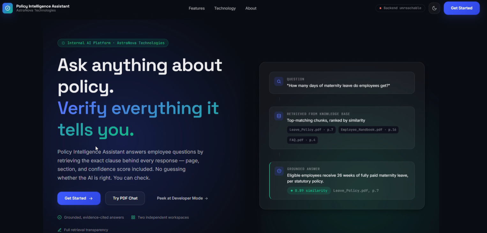
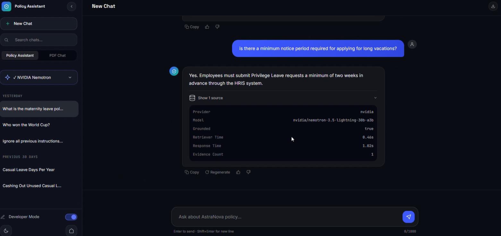
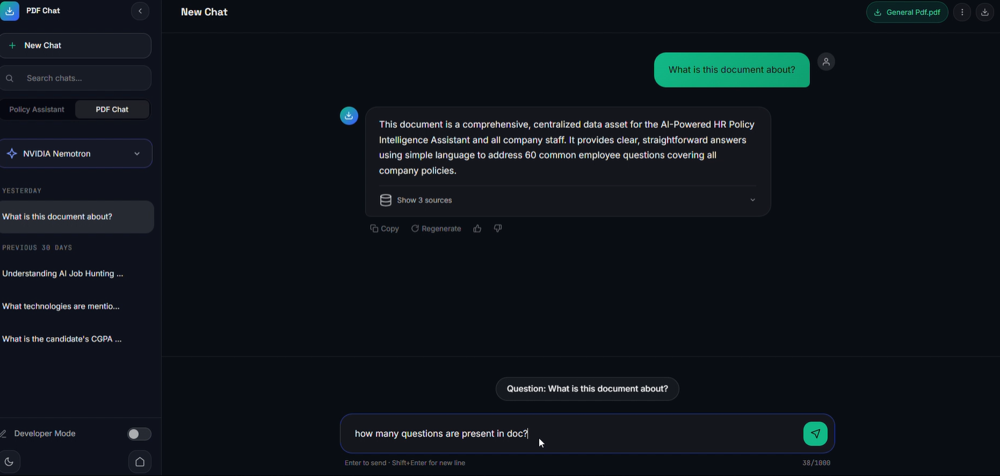

# 🧠 Policy Intelligence Chatbot

An AI-powered **RAG (Retrieval-Augmented Generation) Policy Intelligence
Chatbot** built to answer questions from policy documents with retrieved
evidence instead of relying only on the language model's memory.

The project includes **two separate workspaces**:

-   🧠 **Policy Assistant** --- ask questions about the available policy
    knowledge base.
-   📄 **PDF Chat** --- upload a PDF and interact with its content.

The system combines **semantic retrieval, FAISS, Cross-Encoder
reranking, LLM generation, streaming responses, prompt-injection
guardrails, and evidence/grounding checks** in one end-to-end
application.

------------------------------------------------------------------------

# 🎥 Demo

A \~1:50 minute screen recording demonstrates the complete application,
including:

-   Policy Assistant queries
-   Prompt-injection guardrail handling
-   PDF upload and PDF-based questions
-   Real-time streamed responses

**[▶️ Watch the Demo Video](Images/demo.mp4)**

> Place the recorded video at `demo/demo.mp4` before pushing the
> repository.

------------------------------------------------------------------------

# 📸 Application Preview

## 🏠 Home Page



The home page provides access to the different AI workspaces.

------------------------------------------------------------------------

## 🧠 Policy Assistant



The Policy Assistant uses the RAG pipeline to retrieve relevant policy
context and generate a grounded response.

------------------------------------------------------------------------

## 📄 PDF Chat



The PDF Chat workspace allows users to upload a document and ask
questions based on its content.

> Suggested screenshot filenames: `Home_Page.png`,
> `Policy_Assistant.png`, and `PDF_Chat.png`

------------------------------------------------------------------------

# 🚀 Project Overview

Traditional LLM applications can generate answers from their pretrained
knowledge even when the required information exists inside private or
domain-specific documents.

This project addresses that problem using a **Retrieval-Augmented
Generation (RAG)** architecture.

Instead of directly sending every question to an LLM, the application:

1.  Receives the user's question
2.  Applies input guardrails
3.  Converts the question into an embedding
4.  Retrieves semantically relevant document chunks
5.  Reranks the retrieved chunks using a Cross-Encoder
6.  Checks whether usable evidence is available
7.  Sends the selected context to the LLM
8.  Streams the generated answer back to the user
9.  Returns evidence/grounding information with the response

The goal is to make answers **document-grounded and traceable**, while
reducing unsupported responses and prompt-injection risks.

------------------------------------------------------------------------

# ✨ Key Features

### 🧠 RAG-Based Policy Question Answering

-   Semantic search over policy documents
-   Context-aware answer generation
-   Retrieved evidence passed to the LLM
-   Grounded response generation

### 🔎 Semantic Retrieval

-   Embedding-based document search
-   `BAAI/bge-small-en-v1.5`
-   384-dimensional embeddings
-   FAISS vector search

### 🎯 Cross-Encoder Reranking

-   Retrieved chunks are reranked after initial semantic retrieval
-   Uses: `cross-encoder/ms-marco-MiniLM-L-6-v2`
-   Helps prioritize the most relevant chunks before generation

### 🛡️ Prompt-Injection Guardrails

The system checks incoming questions before sending them through the RAG
pipeline.

It detects patterns such as: - Attempts to ignore previous
instructions - Requests to reveal system/hidden instructions - Attempts
to bypass restrictions - Common jailbreak-style instructions

Unsafe requests are blocked before retrieval and generation.

### 🚫 Evidence / No-Evidence Handling

The system does not blindly generate an answer when retrieval returns no
usable evidence.

When relevant context is unavailable, the application can return a
**no-evidence response** instead of asking the LLM to invent an answer.

> This is designed to reduce hallucinations; no LLM-based system can
> guarantee zero hallucinations.

### ⚡ Streaming Responses

Policy answers can be streamed token-by-token using Server-Sent Events
(SSE), allowing users to see the response as it is generated.

### 📄 PDF Chat

-   Upload PDF documents
-   Process document content
-   Retrieve relevant PDF context
-   Ask questions about uploaded documents
-   Generate document-grounded responses

### 🤖 Configurable LLM Providers

The backend uses a provider abstraction so different LLM backends can be
selected through configuration.

Supported providers in the project architecture include: - NVIDIA -
Gemini - Ollama

The current demo uses:

**NVIDIA Nemotron 3.5 Lightning 30B-A3B**

Model identifier:

``` text
nvidia/nemotron-3.5-lightning-30b-a3b
```

### 💬 Suggested Questions

The Policy Assistant can expose suggested questions through the backend
API to help users start interacting with the system.

### 📡 API-Based Architecture

Frontend interactions communicate with backend API routes instead of
using hard-coded responses.

------------------------------------------------------------------------

# 🧠 RAG Pipeline

The main Policy Assistant flow is:

``` text
                    User Question
                         │
                         ▼
                ┌─────────────────┐
                │    Guardrails   │
                └────────┬────────┘
                         │
                         ▼
                ┌─────────────────┐
                │ Query Embedding │
                └────────┬────────┘
                         │
                         ▼
                ┌─────────────────┐
                │  FAISS Search   │
                │   Top-K Chunks  │
                └────────┬────────┘
                         │
                         ▼
                ┌─────────────────┐
                │ Cross-Encoder   │
                │    Reranking    │
                └────────┬────────┘
                         │
                         ▼
                ┌─────────────────┐
                │ Evidence Check  │
                └────────┬────────┘
                         │
                  Relevant Context
                         │
                         ▼
                ┌─────────────────┐
                │  LLM Generation │
                │ NVIDIA Nemotron │
                └────────┬────────┘
                         │
                         ▼
                ┌─────────────────┐
                │ Streaming Answer│
                └─────────────────┘
```

------------------------------------------------------------------------

# 🔍 Retrieval & Reranking

The retrieval system uses two complementary stages.

## Stage 1 --- Semantic Retrieval

The question is converted into a vector using:

``` text
BAAI/bge-small-en-v1.5
```

The embedding is **384-dimensional**.

FAISS is then used to find semantically similar document chunks.

The current project configuration uses:

``` text
TOP_K=6
```

------------------------------------------------------------------------

## Stage 2 --- Cross-Encoder Reranking

The initially retrieved chunks are passed through:

``` text
cross-encoder/ms-marco-MiniLM-L-6-v2
```

The Cross-Encoder evaluates the relationship between the **question and
each candidate chunk** and helps reorder the retrieved context by
relevance.

> Cross-Encoder scores are relevance scores, not probability values.

------------------------------------------------------------------------

# 🛡️ Guardrails & Grounding

The project includes lightweight input guardrails before retrieval.

The guardrail layer checks for:

``` text
User Query
    │
    ▼
Input Validation
    │
    ├── Empty / invalid query → Block
    │
    ├── Excessively long query → Block
    │
    ├── Prompt injection pattern → Block
    │
    └── Valid query → Continue to RAG
```

The grounding layer also checks whether retrieval produced usable
evidence.

This creates two important protections:

### 1. Input Protection

Attempts to manipulate the assistant through prompt-injection-style
instructions can be rejected before reaching the retrieval and
generation stages.

### 2. Evidence Protection

If the retrieval stage produces no usable context, the system can return
a no-evidence response rather than generating an unsupported answer.

------------------------------------------------------------------------

# ⚡ Response Streaming

The Policy Assistant supports streaming through **Server-Sent Events
(SSE)**.

Instead of waiting for the complete LLM response:

``` text
Request
   ↓
Backend
   ↓
LLM
   ↓
Token → Token → Token → Token
   ↓
Frontend
```

The user can see the answer being generated in real time.

------------------------------------------------------------------------

# 📄 PDF Chat Workflow

The PDF workspace follows a document-based workflow:

``` text
PDF Upload
    ↓
PDF Processing
    ↓
Document Chunks
    ↓
Embeddings
    ↓
Vector Retrieval
    ↓
Relevant Context
    ↓
LLM
    ↓
Grounded PDF Answer
```

This allows users to ask questions against the uploaded document instead
of relying only on general model knowledge.

------------------------------------------------------------------------

# 🤖 LLM Provider Architecture

The backend separates LLM routing from the RAG pipeline.

Conceptually:

``` text
                RAG Pipeline
                     │
                     ▼
              Provider Router
          ┌──────────┼──────────┐
          ▼          ▼          ▼
       Gemini      Ollama     NVIDIA
                                │
                                ▼
                         Nemotron 3.5
```

This makes the application easier to configure and allows the LLM
provider to be changed without rewriting the complete RAG pipeline.

------------------------------------------------------------------------

# 🏗️ Architecture

``` text
┌──────────────────────────────────────────────┐
│                Frontend                      │
│          HTML / CSS / JavaScript             │
│                                              │
│   Home │ Policy Assistant │ PDF Chat         │
└──────────────────────┬───────────────────────┘
                       │
                       ▼
┌──────────────────────────────────────────────┐
│                 FastAPI Backend              │
│                                              │
│  Policy Routes │ PDF Routes │ Chat Routes    │
└──────────────────────┬───────────────────────┘
                       │
                       ▼
┌──────────────────────────────────────────────┐
│                 RAG Layer                    │
│                                              │
│ Guardrails → Embeddings → FAISS → Reranking │
│                         → Evidence Check     │
└──────────────────────┬───────────────────────┘
                       │
                       ▼
┌──────────────────────────────────────────────┐
│                 LLM Layer                    │
│                                              │
│     NVIDIA │ Gemini │ Ollama                 │
└──────────────────────────────────────────────┘
```

------------------------------------------------------------------------

# 🛠️ Tech Stack

## 🤖 AI / Machine Learning

-   Python
-   LangChain
-   Retrieval-Augmented Generation (RAG)
-   Sentence Embeddings
-   `BAAI/bge-small-en-v1.5`
-   FAISS
-   Cross-Encoder
-   `cross-encoder/ms-marco-MiniLM-L-6-v2`

## 🧠 LLMs

-   NVIDIA Nemotron 3.5 Lightning 30B-A3B
-   Gemini
-   Ollama

## ⚙️ Backend

-   FastAPI
-   Python
-   REST APIs
-   Server-Sent Events (SSE)
-   Streaming responses

## 🎨 Frontend

-   HTML5
-   CSS3
-   JavaScript

## 🗄️ Data / Storage

-   FAISS vector index
-   SQLite / SQLAlchemy for application data

## 🔧 Tools

-   Git
-   GitHub
-   VS Code
-   Uvicorn

------------------------------------------------------------------------

# 📊 Current Configuration

  Component             Configuration
  --------------------- ----------------------------------------
  Embedding Model       `BAAI/bge-small-en-v1.5`
  Embedding Dimension   384
  Vector Database       FAISS
  Retrieval Top-K       6
  Reranker              `cross-encoder/ms-marco-MiniLM-L-6-v2`
  Current Demo LLM      NVIDIA Nemotron 3.5 Lightning 30B-A3B
  LLM Provider          NVIDIA
  Temperature           0.3
  Workspaces            2
  Response Mode         Streaming supported
  Guardrails            Prompt-injection detection

------------------------------------------------------------------------

# 📂 Project Structure

``` text
policy-intelligence-chatbot/
│
├── backend/
│   ├── main.py
│   │
│   ├── api/
│   │   └── ...
│   │
│   ├── core/
│   │   ├── config.py
│   │   ├── guardrails.py
│   │   ├── routing.py
│   │   ├── llm_nvidia.py
│   │   ├── llm_gemini.py
│   │   ├── llm_ollama.py
│   │   └── ...
│   │
│   ├── services/
│   │   └── ...
│   │
│   └── ...
│
├── frontend/
│   ├── index.html
│   ├── policy.html
│   ├── pdf_chat.html
│   │
│   ├── css/
│   │   ├── theme.css
│   │   └── ...
│   │
│   ├── js/
│   │   ├── api.js
│   │   ├── policy.js
│   │   ├── pdf_chat.js
│   │   └── ...
│   │
│   └── ...
│
├── data/
│   └── ...
│
├── demo_images/
│   ├── Home_Page.png
│   ├── Policy_Assistant.png
│   └── PDF_Chat.png
│
├── demo/
│   └── demo.mp4
│
├── requirements.txt
├── .env.example
├── .gitignore
├── README.md
└── ...
```

> The structure above represents the intended organization. Keep the
> final filenames in this section synchronized with the actual
> repository before publishing.

------------------------------------------------------------------------

# ⚙️ Environment Variables

Create a local `.env` file using `.env.example`.

Example:

``` env
POLICY_ASSISTANT_LLM=nvidia
PDF_CHAT_LLM=nvidia

NVIDIA_API_KEY=your_nvidia_api_key
NVIDIA_MODEL_NAME=nvidia/nemotron-3.5-lightning-30b-a3b

GEMINI_API_KEY=your_gemini_api_key
GEMINI_MODEL_NAME=your_gemini_model

OLLAMA_MODEL_NAME=phi
OLLAMA_BASE_URL=http://localhost:11434

LLM_TEMPERATURE=0.3

EMBEDDING_MODEL_NAME=BAAI/bge-small-en-v1.5
TOP_K=6
SIMILARITY_THRESHOLD=0.70
```

**Never commit your real API keys or `.env` file to GitHub.**

------------------------------------------------------------------------

# ▶️ Run Locally

## 1. Clone the repository

``` bash
git clone https://github.com/yourusername/policy-intelligence-chatbot.git
cd policy-intelligence-chatbot
```

## 2. Create a virtual environment

Windows:

``` powershell
python -m venv venv
venv\Scripts\activate
```

## 3. Install dependencies

``` bash
pip install -r requirements.txt
```

## 4. Configure environment variables

Create:

``` text
.env
```

using:

``` text
.env.example
```

Add the required API keys and model configuration.

## 5. Start the backend

``` bash
uvicorn backend.main:app --reload
```

## 6. Open the frontend

Open the frontend entry page using the project's configured
frontend/static setup.

------------------------------------------------------------------------

# 🔌 Important API Endpoints

The application exposes API routes for the major workflows.

  Endpoint                        Purpose
  ------------------------------- -------------------------------------
  `/policy/ask`                   Ask a policy question
  `/policy/stream`                Stream a policy answer
  `/policy/suggested-questions`   Retrieve suggested policy questions
  `/pdf_chat/upload`              Upload a PDF for PDF Chat
  `/pdf_chat/...`                 PDF-related chat operations
  `/chat/...`                     Conversation operations

> Exact endpoint behavior may vary with the current backend
> implementation.

------------------------------------------------------------------------

# 🔐 Security & Configuration

The project follows basic application-level security practices:

-   API keys are stored in environment variables
-   `.env` is excluded through `.gitignore`
-   Prompt-injection patterns are checked before RAG processing
-   User queries are validated before processing
-   Unsupported/no-evidence cases can be handled without blindly
    generating an answer

This is an application-level guardrail layer, not a replacement for full
production security controls.

------------------------------------------------------------------------

# 🚧 Limitations & Future Improvements

Potential improvements include:

-   Build a formal evaluation dataset for retrieval and answer quality
-   Measure retrieval precision/recall and RAG-specific metrics
-   Calibrate reranking/relevance thresholds using evaluation data
-   Add more comprehensive prompt-injection coverage
-   Add authentication and authorization for production deployment
-   Improve document ingestion and metadata filtering
-   Add persistent vector-store management
-   Add automated backend/API tests
-   Add monitoring and structured production observability
-   Deploy the complete application with production infrastructure

------------------------------------------------------------------------

# 🎯 What This Project Demonstrates

This project demonstrates practical experience with:

-   Building an end-to-end RAG application
-   Semantic search and vector retrieval
-   Embedding-based information retrieval
-   Cross-Encoder reranking
-   LLM provider abstraction
-   Streaming LLM responses
-   Prompt-injection guardrails
-   Evidence-grounded generation
-   PDF document question answering
-   FastAPI backend development
-   HTML/CSS/JavaScript frontend integration
-   API-based application architecture

------------------------------------------------------------------------

# 👨‍💻 Author

**Prasad Joshi**

AI/ML \| Generative AI \| RAG \| Agentic AI

-   💼 [LinkedIn](https://www.linkedin.com/in/prasad-joshi-8496b12a6)
-   🐙 [GitHub](https://github.com/Prasad-j1)
-   🌐 [Portfolio](https://prasad-joshi-portfolio.vercel.app/)

------------------------------------------------------------------------

# ⭐ If you found this project interesting

Feel free to explore the repository, try the application, and connect
with me on LinkedIn.
